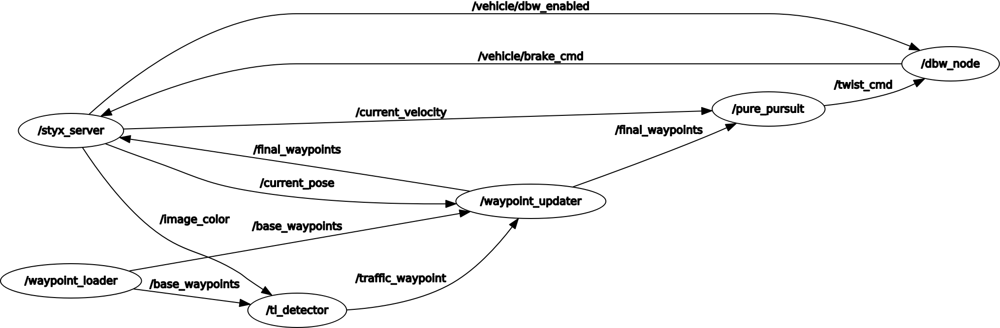
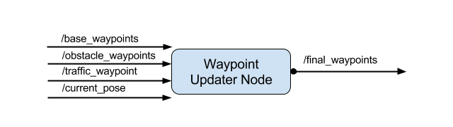

# Project Capstone

This is the project repo for the final project of the Udacity Self-Driving Car Nanodegree: Programming a Real Self-Driving Car.

## The Solution

The solution consist of several nodes. Some of them were already implemented by Udacity. And the following three nodes needed to be implemented by the student:

- [Traffic Light Detection Node](ros/src/tl_detector/tl_detector.py)
- [Waypoint Updater Node](ros/src/waypoint_updater/waypoint_updater.py)
- [DBW (drive by wire) Node](ros/src/twist_controller/dbw_node.py)

Here you can see all nodes which run, when you use the simulator:



### Traffic Light Detection Node

The traffic light detection node uses the parameter `/traffic_light_config` to get the positions of the stop lines (from a predefined map). The topic `/current_pose` and `/base_waypoints` are used to determine the nearest stop line and the corresponding waypoint. The last topic, this node uses, is the `/image_color`. This topic publishes the images from the camera mounted to the car. Using these images the car should detect traffic lights and classify them, wether they are read yellow or green. If the light is red, the vehicle should stop in front of the traffic light and wait until it gets green. Therefore it publishes the next detected stop traffic light to the topic `/traffic_waypoint`.


Currently the traffic light detector and classifier is very simple. It converts the image to HSV and uses some thresholds to filter for red colors. If the counts of the red colors are higher than a threshold, the image is considered to contain a red stop light. In order to compensate some false detections the number of red pixels is multiplied with a probability value. This probability is calculated based on how likely it is, that the car can see a red traffic light. The orientation of the vehicle to the next traffic light and the distance to the next traffic light are used to calculate the probability.

### Waypoint Updater Node

The waypoint updater node uses the parameter `/waypoint_loader/velocity` to get the maximum speed the car should drive. The topic `/current_pose` and `/base_waypoints` are used to determine the upcoming trajectory the vehicle should follow. If a red stop light is detected and received from the topic `/traffic_waypoint` this node calculates the deceleration needed to stop in front of the stop line. The topic `/obstacle_waypoints` is currently not used.



### DBW (drive by wire) Node

Finally the DBW node uses several parameters describing the vehicle's physics. These parameters are used to calculate the steering angle, throttle and brake. It receives commands from the `/twist_cmd` topic. Comparing the desired velocity from the twist command with the current velocity from the topic `/current_velocity` gives a difference. This error is fed into a PID controller to calculate throttle and brake commands (published to `/vehicle/throttle_cmd` and `/vehicle/brake_cmd`). For the steering command the twist command includes not only a longitudinal velocity, but also a lateral velocity. Both velocities are used by the YawController to create steering angle commands (published to `/vehicle/steering_cmd`). If the topic `/vehicle/dbw_enabled` sends a value of `False`, the DBW node disables all commands and sends zeros, so the driver can control the car.


## Installation

Please use **one** of the two installation options, either native **or** docker installation.

### Native Installation

* Be sure that your workstation is running Ubuntu 16.04 Xenial Xerus or Ubuntu 14.04 Trusty Tahir. [Ubuntu downloads can be found here](https://www.ubuntu.com/download/desktop).
* If using a Virtual Machine to install Ubuntu, use the following configuration as minimum:
  * 2 CPU
  * 2 GB system memory
  * 25 GB of free hard drive space

  The Udacity provided virtual machine has ROS and Dataspeed DBW already installed, so you can skip the next two steps if you are using this.

* Follow these instructions to install ROS
  * [ROS Kinetic](http://wiki.ros.org/kinetic/Installation/Ubuntu) if you have Ubuntu 16.04.
  * [ROS Indigo](http://wiki.ros.org/indigo/Installation/Ubuntu) if you have Ubuntu 14.04.
* [Dataspeed DBW](https://bitbucket.org/DataspeedInc/dbw_mkz_ros)
  * Use this option to install the SDK on a workstation that already has ROS installed: [One Line SDK Install (binary)](https://bitbucket.org/DataspeedInc/dbw_mkz_ros/src/81e63fcc335d7b64139d7482017d6a97b405e250/ROS_SETUP.md?fileviewer=file-view-default)
* Download the [Udacity Simulator](https://github.com/udacity/CarND-Capstone/releases).

### Docker Installation
[Install Docker](https://docs.docker.com/engine/installation/)

Build the docker container
```bash
docker build . -t capstone
```

Run the docker file
```bash
docker run -p 4567:4567 -v $PWD:/capstone -v /tmp/log:/root/.ros/ --rm -it capstone
```

### Port Forwarding
To set up port forwarding, please refer to the [instructions from term 2](https://classroom.udacity.com/nanodegrees/nd013/parts/40f38239-66b6-46ec-ae68-03afd8a601c8/modules/0949fca6-b379-42af-a919-ee50aa304e6a/lessons/f758c44c-5e40-4e01-93b5-1a82aa4e044f/concepts/16cf4a78-4fc7-49e1-8621-3450ca938b77)

### Usage

1. Clone the project repository
```bash
git clone https://github.com/udacity/CarND-Capstone.git
```

2. Install python dependencies
```bash
cd CarND-Capstone
pip install -r requirements.txt
```
3. Make and run styx
```bash
cd ros
catkin_make
source devel/setup.sh
roslaunch launch/styx.launch
```
4. Run the simulator

### Real world testing
1. Download [training bag](https://s3-us-west-1.amazonaws.com/udacity-selfdrivingcar/traffic_light_bag_file.zip) that was recorded on the Udacity self-driving car.
2. Unzip the file
```bash
unzip traffic_light_bag_file.zip
```
3. Play the bag file
```bash
rosbag play -l traffic_light_bag_file/traffic_light_training.bag
```
4. Launch your project in site mode
```bash
cd CarND-Capstone/ros
roslaunch launch/site.launch
```
5. Confirm that traffic light detection works on real life images
